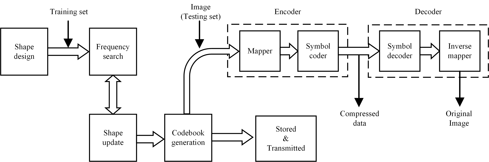

# Soft Compression: An Approach to Shape Coding for Images

## [[Paper]](https://ieeexplore.ieee.org/document/9247990) [[Citation]](#citation)

### Abstract

In this paper, we propose soft compression, an lossless compression approach to shape coding for images using location 
index and codebook of designed shapes with various sizes. This method is different from traditional image compression 
methods, as it aims at finding the basic shape blocks of pictures to improve the compression ratio from the perspective 
of information theory and frequency. In particular, the triplets including location and codeword are stored when 
encoding an image instead of the entire array. It is shown that soft compression can greatly reduce the bandwidth and 
storage space needed in the process of transmitting and storing the same kind of images.

### Framework and Role
- This code is designed for binary image compression, which is in lossless mode. 
- The code can train and test the cross compression results on the MNIST dataset.
#### Flowchart
<div align="center">
  
</div>


## Prerequisites for Code

Required packages:
```
pip install opencv-python --user
pip install opencv-contrib-python --user
pip install numpy
```

Datasets:

```
MNIST: http://yann.lecun.com/exdb/mnist/
```


##### Notes
- We tested this code with Python 3.8 and opencv 4.0.1.
- The code also works with other versions of the packages.


## Main Modules
- To train a model yourself, you have to first prepare the data as shown in [[Prerequisites for Code]](#prerequisites-for-code)
- Then, put them into folder 'Dataset\\MNIST'
- After preparation, you can run 'main.py' to get the cross results by using soft compression algorithm for binary image

## Other Information
**NOTE**: The program may take a long time. We run it with multiprocessing. You can choose optional methods to accelerate it

## Future Work

- Iterative soft compression algorithm makes it have better performance
- Optimize program and improve efficiency

## Citation

If you use the work released here for your research, please cite this paper:
```
@article{xin2020soft,
  title={Soft Compression: An Approach to Shape Coding for Images},
  author={Xin, Gangtao and Li, Zhefan and Zhu, Zheqi and Wan, Shuo and Fan, Pingyi and Letaief, Khaled B},
  journal={IEEE Communications Letters},
  year={2020},
  publisher={IEEE}
}
}
```
